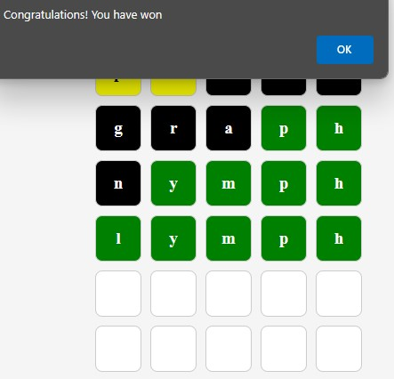

# Wordle Game

Another project to practice Java OOP, Spring Boot, REST service and JavaScript and/or Thymeleaf front-end.<br>


## Building and deployment

Can be edited and tested locally by loading the whole <u>Maven</u> project in any IDE.

Or you can use Maven (wrapper) with Spring Boot plugin directly to run or package the app.
```
./mvnw spring-boot:run
```
The app may be packaged as a .jar archive and run by any JVM:
```
mvn clean package
java -jar FILENAME.jar
```
## Playing the game

After the deployment, open the following URL in any browser: http://localhost:8080/WordleSPA.html

## Acknowledgements
The original game was invented by Josh Wardle ([Wikipedia](https://en.wikipedia.org/wiki/Wordle)).<br>
To a large degree, this version of the game was developed under guidance of [Shai Almog](https://www.udemy.com/user/shaialmog/) aka Debug Agent.


